# Freighter Mobile Authentication Flow

## Overview

The Freighter Mobile authentication system is built around a sophisticated
multi-layered security architecture that balances user experience with robust
security practices. The system manages Stellar blockchain wallets through
encrypted storage, temporary session management, and automatic security
timeouts.

## Core Architecture Components

### 1. **Authentication States**

The system operates on three primary authentication states:

- `NOT_AUTHENTICATED`: No accounts exist in the system
- `HASH_KEY_EXPIRED`: Accounts exist but user session has expired
- `AUTHENTICATED`: Valid session with access to decrypted account data

### 2. **Storage Layers**

- **Non-sensitive storage** (`dataStorage`): Account metadata, network settings,
  active account ID
- **Secure storage** (`secureDataStorage`): Encrypted temporary store and hash
  keys
- **Key Manager**: Stellar SDK key management with additional encryption layer

### 3. **Temporary Store Architecture**

The temporary store is the heart of the security system. It contains:

```typescript
interface TemporaryStore {
  privateKeys: { [accountId: string]: string }; // Private keys by account ID
  mnemonicPhrase: string; // Master seed phrase
}
```

This store is encrypted using a hash key derived from the user's password and
stored securely. It has a configurable expiration time
(`HASH_KEY_EXPIRATION_MS`).

## Authentication Flows

### Sign Up Process

1. **Input Validation**: User create a password and a new mnemonic phrase is
   generated.
2. **Key Derivation**: Generate first keypair from mnemonic using
   `StellarHDWallet.fromMnemonic()`
3. **Data Cleanup**: Clear any existing data with `clearAllData()`
4. **Account Storage**:
   - Store encrypted key in Key Manager using `ScryptEncrypter`
   - Create account entry in non-sensitive storage
   - Set as active account
5. **Temporary Store Creation**:
   - Generate hash key from password using `deriveKeyFromPassword()`
   - Encrypt temporary store containing private keys and mnemonic
   - Set expiration timestamp
6. **State Update**: Set `AUTH_STATUS.AUTHENTICATED` and fetch active account

### Sign In Process

The sign-in process is more complex due to account discovery and validation:

1. **Password Validation**: Attempt to decrypt stored key using Key Manager
2. **Data Integrity Check**: Verify the key contains required mnemonic phrase
   data
3. **Account Reconciliation**: Ensure account exists in account list (create if
   missing)
4. **Temporary Store Recreation**:
   - Generate new hash key from password
   - Create encrypted temporary store with active account data
5. **Network Account Discovery**:
   - Check first 5 derived keypairs against Stellar mainnet
   - Identify accounts that exist on-chain but not locally
   - Automatically import discovered accounts
6. **Private Key Consolidation**:
   - Ensure all local accounts have private keys in temporary store
   - Try loading from Key Manager first, fallback to mnemonic derivation
   - Update temporary store with any missing keys

### Import Wallet Process

Similar to sign-up but includes automatic account discovery:

1. **Standard Import**: Follow sign-up process with provided mnemonic
2. **Network Discovery**: Call `verifyAndCreateExistingAccountsOnNetwork()`
3. **Account Creation**: Automatically create entries for any accounts found on
   mainnet
4. **Bulk Update**: Update temporary store with all discovered private keys in
   one operation

## Lock Screen and Session Management

### How Accounts Get Locked

Accounts are locked when:

- Hash key expires (time-based expiration)
- User manually logs out (partial logout)
- App detects corrupted temporary store
- Authentication validation fails

### Lock Screen Behavior

When locked, the system:

1. **Preserves Account Data**: Non-sensitive account information remains
2. **Shows Public Key**: Displays active account's public key for user reference
3. **Clears Sensitive Data**: Removes temporary store and hash key
4. **Sets Expired State**: Updates auth status to `HASH_KEY_EXPIRED`
5. **Navigation**: Automatically navigates to lock screen using
   `navigationRef.resetRoot()`

The lock screen allows password re-entry without losing account configuration.

## Temporary Store Deep Dive

### Creation Process

```typescript
const createTemporaryStore = async (input) => {
  // 1. Generate or retrieve hash key
  const hashKeyObj = shouldRefreshHashKey
    ? await generateHashKey(password)
    : await getHashKey();

  // 2. Create/update store object
  const temporaryStoreObj = {
    ...existingStore,
    privateKeys: { ...existing, [accountId]: privateKey },
    mnemonicPhrase,
  };

  // 3. Encrypt and store
  const encryptedData = await encryptDataWithPassword({
    data: JSON.stringify(temporaryStoreObj),
    password: hashKeyObj.hashKey,
    salt: hashKeyObj.salt,
  });
};
```

### Security Features

- **Encryption**: AES encryption using password-derived key
- **Salt**: Unique salt per hash key generation
- **Expiration**: Automatic expiry prevents indefinite access
- **Integrity**: Structure validation on retrieval

### Retrieval and Validation

The system validates temporary store integrity on every access:

- Checks hash key expiration
- Verifies decryption success
- Validates store structure
- Auto-clears corrupted data

## Account Management

### Account Creation

New accounts are created by:

1. Finding unique derivation index (prevents duplicates)
2. Deriving keypair from master mnemonic
3. Storing in Key Manager with encryption
4. Adding to account list
5. Updating temporary store without refreshing hash key

### Account Selection

When switching accounts:

1. Validate account exists in account list
2. Update active account ID in storage
3. Fetch account data from temporary store
4. Update UI state

### Account Discovery Algorithm

For imported wallets, the system:

1. Derives first 5 keypairs from mnemonic
2. Queries Stellar network for account existence
3. Compares with locally stored accounts
4. Creates missing accounts found on network
5. Updates temporary store with all private keys

## Error Handling and Recovery

### Corrupted Data Recovery

- **Key Manager Errors**: Clear all data and restart onboarding
- **Temporary Store Corruption**: Clear sensitive data, preserve accounts
- **Hash Key Issues**: Force re-authentication

### Password Retry Logic

- Invalid passwords allow unlimited retries
- No account lockout mechanism
- Preserves account data during retry attempts

## Security Considerations

### Hash Key Management

- **Derivation**: Uses `scrypt` for password-based key derivation
- **Storage**: Encrypted hash key stored separately from temporary store
- **Expiration**: Configurable timeout (default in `HASH_KEY_EXPIRATION_MS`)

### Private Key Protection

- **Never Plaintext**: Private keys never stored unencrypted
- **Memory Management**: Sensitive data cleared from memory when possible
- **Access Control**: Only available during authenticated sessions

### Network Security

- **Mainnet Discovery**: Only checks account existence, doesn't expose private
  data
- **Testnet Default**: Key manager uses testnet by default for additional
  security

## Development Notes

### State Management

Uses Zustand for predictable state management with async action support. State
updates are batched and error boundaries prevent corruption.

### Navigation Integration

Tightly integrated with React Navigation:

- Automatic lock screen navigation
- Route reset for security transitions
- Navigation reference management

### Testing Considerations

- Mock Key Manager for unit tests
- Test password derivation separately
- Validate encryption/decryption cycles
- Test network discovery with various account configurations

### Performance Optimization

- Lazy loading of accounts
- Batched temporary store updates
- Parallel network queries for account discovery
- Efficient key derivation caching

```mermaid
flowchart TD
    Start([App Start]) --> InitStore[Initialize Store]
    InitStore --> LoadNetwork[Load Active Network from Storage]
    LoadNetwork --> CheckAuth{Get Auth Status}

    %% Auth Status Check Flow
    CheckAuth --> HasAccounts{Check if accounts exist}
    HasAccounts -->|No accounts| NotAuth[AUTH_STATUS.NOT_AUTHENTICATED]
    HasAccounts -->|Has accounts| CheckHashKey{Hash key exists?}

    CheckHashKey -->|No hash key| HashExpired[AUTH_STATUS.HASH_KEY_EXPIRED]
    CheckHashKey -->|Has hash key| CheckTempStore{Temporary store exists?}

    CheckTempStore -->|No temp store| HashExpired
    CheckTempStore -->|Has temp store| CheckExpiration{Hash key expired?}

    CheckExpiration -->|Expired| HashExpired
    CheckExpiration -->|Valid| Authenticated[AUTH_STATUS.AUTHENTICATED]

    %% Navigation based on auth status
    NotAuth --> ShowWelcome[Show Welcome Screen]
    HashExpired --> NavigateLock[Navigate to Lock Screen]
    Authenticated --> FetchAccount[Fetch Active Account]

    %% Sign Up Flow
    ShowWelcome --> SignUpAction{User chooses Sign Up}
    SignUpAction --> InputMnemonic[Input Mnemonic & Password]
    InputMnemonic --> DeriveKeyPair[Derive Key Pair from Mnemonic]
    DeriveKeyPair --> ClearAllData1[Clear All Existing Data]
    ClearAllData1 --> StoreAccount1[Store Account in Key Manager]
    StoreAccount1 --> GenerateHashKey1[Generate Hash Key from Password]
    GenerateHashKey1 --> CreateTempStore1[Create Encrypted Temporary Store]
    CreateTempStore1 --> SetAuthSuccess1[Set AUTH_STATUS.AUTHENTICATED]
    SetAuthSuccess1 --> FetchAccountSuccess1[Fetch Active Account]

    %% Import Wallet Flow
    ShowWelcome --> ImportAction{User chooses Import}
    ImportAction --> InputImportMnemonic[Input Mnemonic & Password]
    InputImportMnemonic --> DeriveImportKeyPair[Derive Key Pair from Mnemonic]
    DeriveImportKeyPair --> ClearAllData2[Clear All Existing Data]
    ClearAllData2 --> StoreAccount2[Store Account in Key Manager]
    StoreAccount2 --> GenerateHashKey2[Generate Hash Key from Password]
    GenerateHashKey2 --> CreateTempStore2[Create Encrypted Temporary Store]
    CreateTempStore2 --> VerifyExisting[Verify Existing Accounts on Network]

    VerifyExisting --> CheckNetworkAccounts{Check first 5 keypairs on mainnet}
    CheckNetworkAccounts --> FindExisting{Found existing accounts?}
    FindExisting -->|Yes| CheckLocal{Already exist locally?}
    FindExisting -->|No| SetAuthSuccess2[Set AUTH_STATUS.AUTHENTICATED]

    CheckLocal -->|Not local| CreateMissingAccounts[Create Missing Accounts]
    CheckLocal -->|Already local| SetAuthSuccess2
    CreateMissingAccounts --> UpdateTempStore[Update Temporary Store with new keys]
    UpdateTempStore --> SetAuthSuccess2
    SetAuthSuccess2 --> FetchAccountSuccess2[Fetch Active Account]

    %% Sign In Flow
    NavigateLock --> ShowLockScreen[Show Lock Screen with Public Key]
    ShowLockScreen --> InputPassword[User inputs password]
    InputPassword --> LoadKeyFromManager{Load key from Key Manager}

    LoadKeyFromManager -->|Invalid password| ShowPasswordError[Show Invalid Password Error]
    LoadKeyFromManager -->|Valid password| ValidateKeyData{Key has mnemonic data?}

    ShowPasswordError --> InputPassword
    ValidateKeyData -->|No mnemonic| ClearAllData3[Clear All Data - Corrupted]
    ValidateKeyData -->|Has mnemonic| FindAccountInList{Find account in account list?}

    ClearAllData3 --> ShowError1[Show Error: No Key Pair Found]
    FindAccountInList -->|Not found| CreateAccountEntry[Create account entry]
    FindAccountInList -->|Found| CreateInitialTempStore[Create Temporary Store with active account]

    CreateAccountEntry --> CreateInitialTempStore
    CreateInitialTempStore --> DiscoverNetworkAccounts[Discover existing accounts on network]
    DiscoverNetworkAccounts --> EnsureAllKeys[Ensure all account private keys in temp store]

    EnsureAllKeys --> LoadFromKeyManager{Try load from Key Manager}
    LoadFromKeyManager -->|Success| AddToTempStore[Add private key to temp store]
    LoadFromKeyManager -->|Failed| TryDerivation{Try derive from mnemonic}

    TryDerivation -->|Found match| AddToTempStore
    TryDerivation -->|No match| SkipAccount[Skip this account]
    AddToTempStore --> CheckMoreAccounts{More accounts to process?}
    SkipAccount --> CheckMoreAccounts

    CheckMoreAccounts -->|Yes| LoadFromKeyManager
    CheckMoreAccounts -->|No| UpdateFinalTempStore[Update final temporary store]
    UpdateFinalTempStore --> SetAuthSuccess3[Set AUTH_STATUS.AUTHENTICATED]
    SetAuthSuccess3 --> FetchAccountSuccess3[Fetch Active Account]

    %% Create Account Flow
    FetchAccount --> UserCreateAccount{User creates new account}
    UserCreateAccount --> LoadExistingKey[Load existing key from Key Manager]
    LoadExistingKey --> GetMnemonic[Extract mnemonic phrase]
    GetMnemonic --> FindUniqueIndex[Find unique account index]

    FindUniqueIndex --> CheckIndexExists{Index already exists?}
    CheckIndexExists -->|Yes| IncrementIndex[Increment index]
    CheckIndexExists -->|No| DeriveNewKeyPair[Derive new key pair]
    IncrementIndex --> CheckIndexExists

    DeriveNewKeyPair --> StoreNewAccount[Store new account in Key Manager]
    StoreNewAccount --> UpdateTempStoreNew[Update temporary store without refreshing hash key]
    UpdateTempStoreNew --> RefreshAccounts[Refresh all accounts and active account]

    %% Select Account Flow
    FetchAccount --> UserSelectAccount{User selects different account}
    UserSelectAccount --> ValidateSelection{Selected account exists?}
    ValidateSelection -->|No| ShowAccountError[Show Account Not Found Error]
    ValidateSelection -->|Yes| SetActiveAccount[Set as active account in storage]
    SetActiveAccount --> LoadSelectedAccount[Load selected account data]
    LoadSelectedAccount --> UpdateActiveState[Update active account state]

    %% Logout Flow
    FetchAccount --> UserLogout{User initiates logout}
    UserLogout --> CheckWipeFlag{Wipe all data flag?}
    CheckWipeFlag -->|Yes| ClearAllData4[Clear all data including accounts]
    CheckWipeFlag -->|No| CheckAccountsExist{Accounts exist?}

    CheckAccountsExist -->|No| ClearAllData4
    CheckAccountsExist -->|Yes| ClearSensitiveOnly[Clear only sensitive data]

    ClearAllData4 --> SetNotAuth[Set AUTH_STATUS.NOT_AUTHENTICATED]
    ClearSensitiveOnly --> SetHashExpired[Set AUTH_STATUS.HASH_KEY_EXPIRED]

    SetNotAuth --> ShowWelcome
    SetHashExpired --> NavigateLock

    %% Rename Account Flow
    FetchAccount --> UserRename{User renames account}
    UserRename --> UpdateAccountName[Update account name in storage]
    UpdateAccountName --> RefreshAccountData[Refresh account data and active account]

    %% Network Selection Flow
    FetchAccount --> UserSelectNetwork{User selects network}
    UserSelectNetwork --> SaveNetwork[Save network to storage]
    SaveNetwork --> UpdateNetworkState[Update network state]

    %% Error Handling
    ShowError1 --> ShowWelcome
    ShowAccountError --> FetchAccount

    %% Hash Key Expiration Detection
    FetchAccountSuccess1 --> MonitorExpiration{Monitor hash key expiration}
    FetchAccountSuccess2 --> MonitorExpiration
    FetchAccountSuccess3 --> MonitorExpiration
    RefreshAccounts --> MonitorExpiration
    UpdateActiveState --> MonitorExpiration
    RefreshAccountData --> MonitorExpiration

    MonitorExpiration -->|Key expires| AutoLogout[Auto logout to lock screen]
    MonitorExpiration -->|Key valid| ContinueSession[Continue session]

    AutoLogout --> NavigateLock
    ContinueSession --> FetchAccount

    %% Styling
    classDef authStatus fill:#e1f5fe
    classDef userAction fill:#fff3e0
    classDef errorState fill:#ffebee
    classDef successState fill:#e8f5e8
    classDef decisionPoint fill:#f3e5f5

    class NotAuth,HashExpired,Authenticated authStatus
    class SignUpAction,ImportAction,UserCreateAccount,UserSelectAccount,UserLogout,UserRename,UserSelectNetwork userAction
    class ShowPasswordError,ShowError1,ShowAccountError errorState
    class SetAuthSuccess1,SetAuthSuccess2,SetAuthSuccess3,FetchAccountSuccess1,FetchAccountSuccess2,FetchAccountSuccess3 successState
    class HasAccounts,CheckHashKey,CheckTempStore,CheckExpiration,LoadKeyFromManager,ValidateKeyData,FindAccountInList,CheckIndexExists,ValidateSelection,CheckWipeFlag,CheckAccountsExist decisionPoint
```


